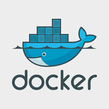

# :star2: Docker-CheatSheet :star2:

A CheatSheet to get you started with docker 

<p align="center">

</p>

## Installation 
```sh
 
  This is for Ubuntu
 
    - Install few packages which are required beforehand

    sudo apt install apt-transport-https ca-certificates curl software-properties-common

    - Add GPG key 

    curl -fsSL https://download.docker.com/linux/ubuntu/gpg | sudo apt-key add -

    - Add Docker repository to apt sources

    sudo add-apt-repository "deb [arch=amd64] https://download.docker.com/linux/ubuntu bionic stable"

    - Update your existing list of packages
    
    sudo apt update

    - Install Docker-ce

    sudo apt install docker-ce

    - Start Docker Process

    sudo systemctl status docker 

```

## Difference between Docker and VMs

<p align="center">

</p>


## Docker commands :whale2:
```sh

 * Check all docker containers
   docker ps -a

 * Check all started docker containers
   docker ps

 * Start a stopped container
   docker start <container-name>

 * Stop a container
   docker stop <container-name>

 * Remove all containers
   docker stop $(docker ps -a -q)
   docker rm $(docker ps -a -q) 

 * Attach to a container
   docker start <container-name>
   docker attach <container-name>

 * Run bash shell in container
   docker container exec -it <container-name> bash
 
 * Delete container forcefully
   docker container rm -f <container-name>

 * Download a new docker image
   docker pull <image-name:version>

 * Docker Stats
   docker stats

 * See all Docker images
   docker images

 * Delete an Image
   docker rmi <image-name>

```

## Launching containers :computer:
```sh

 * Launch container from an image
   docker run -itd --name <container-name>  <image-name>

   i: interactive
   t: tty
   d: background process

 * Launch container with specific port
   docker run -it -p <host-port>:<docker-port>  <image-name>
   
 * Lauching an nginx container which runs on port 80
   docker pull nginx
   docker run -itd -p 80:80  --name webserver  nginx

   Check using docker ps container should be present

```


## Docker file :package:
```sh

 * Build a docker image using a Dockerfile
   docker build -t <image name you want to give>  <Dockerfile path>

 
 * Push image to docker hub
   docker login  (Login to docker hub only needed once)
   docker tag <localsystem image name>   <username>/<preferred image name>
   docker push <username>/<preferred image name>


```

## Cool Links to Follow and Checkout
```sh
- How Netflix Uses Devops
  [Blog 1] (https://netflixtechblog.com/applying-netflix-devops-patterns-to-windows-2a57f2dbbf79)
  [Blog 2] (https://netflixtechblog.com/full-cycle-developers-at-netflix-a08c31f83249)

- [Kubernetes in Quora] (https://www.quora.com/q/quoraengineering/Adopting-Kubernetes-at-Quora)

- [Devops in Mercedes-Benz] (https://www.youtube.com/watch?v=PR-vV1zS1JE&feature=youtu.be)

- [Use cases of Kubernetes] (https://dzone.com/articles/how-big-companies-are-using-kubernetes)

```